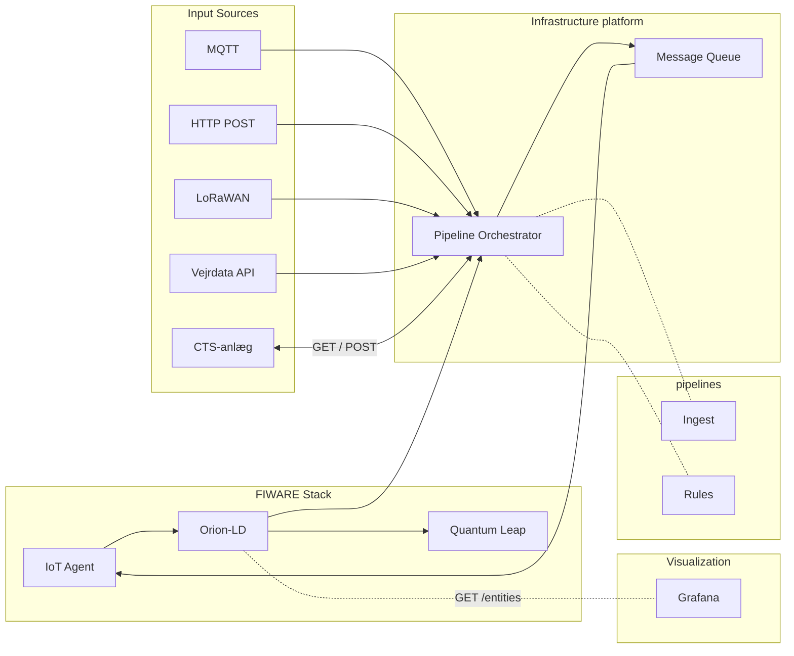

## Overview

This document describes the system architecture for the OS2 AI Heat Control platform using FIWARE as the central data infrastructure.

## Architecture Diagram

## Hvorfor denne løsning?

Traditionelt skal man bygge sin egen integrationsplatform med databaser, device management, API'er og brugergrænseflader. Det tager tid og kræver vedligeholdelse.

**Her gør vi det anderledes:**

- **Ingen database** - data flyder bare igennem
- **Ingen brugergrænseflade** - alt er konfigurationsfiler
- **Kun input → transform → output** - præcis det der er brug for
- **Alt er deklarativt YAML** - pipelines som kode i stedet for at skrive custom programmering
- **NATS håndterer buffering og levering** - så systemet er stabilt selv under stor belastning

**Resultatet er simpelt:** Du skriver configs der fortæller "hvad" der skal ske - ikke hvordan. Og så virker det.

