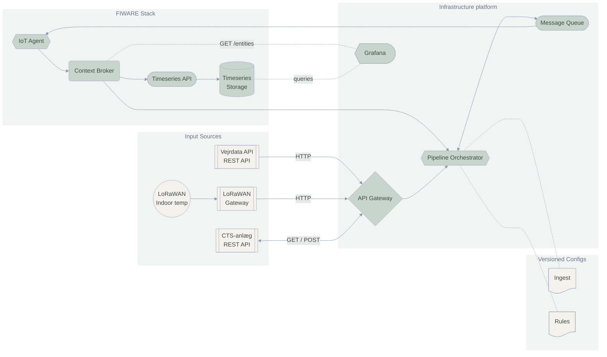

## Overblik

Dette dokument beskriver systemarkitekturen for OS2 AI Heat Control platformen. Systemet bruger en Pipeline Orchestrator til at koordinere dataflows fra forskellige inputkilder gennem deklarative pipelines, med FIWARE (Orion-LD, IoT Agent, Quantum Leap) som central datainfrastruktur.

## Architecture Diagram

## Hvorfor denne løsning?

Istedet for at investere i at bygge og vedligeholde sin egen integrationsplatform med databaser, device management, API'er og brugergrænseflader er denne reference arkitektur løstkoblet og består af genbrug af eksisterende løsninger.

### Genbrug af Open Source



[Envoy Proxy](https://www.envoyproxy.io/docs) - HTTP endpoints for alle datakilder



[WarpStream Bento](https://warpstreamlabs.github.io/bento/) - deklarative pipelines der transformerer og router data



[NATS JetStream](https://docs.nats.io/nats-concepts/jetstream) - buffering og reliable delivery under høj belastning



[FIWARE IoT Agent](https://iotagent-node-lib.readthedocs.io/en/latest/) - device management og protokol konvertering



[Grafana](https://www.grafana.com/docs/) - dashboards og visualisering af entiteter og tidsseriedata



[FIWARE Orion-LD](https://fiware-academy.readthedocs.io/en/latest/core/orion-ld.html) - context broker + [TimescaleDB](https://docs.timescale.com/) for timeseries via Quantum Leap API



**Resultatet er simpelt:** Du skriver configs der fortæller "hvad" der skal ske - ikke hvordan. Og så virker det.

