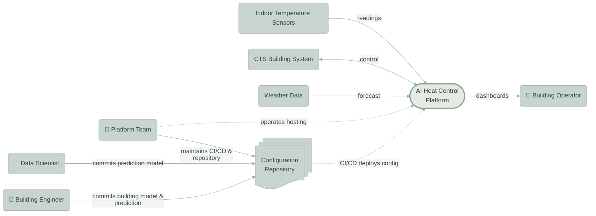
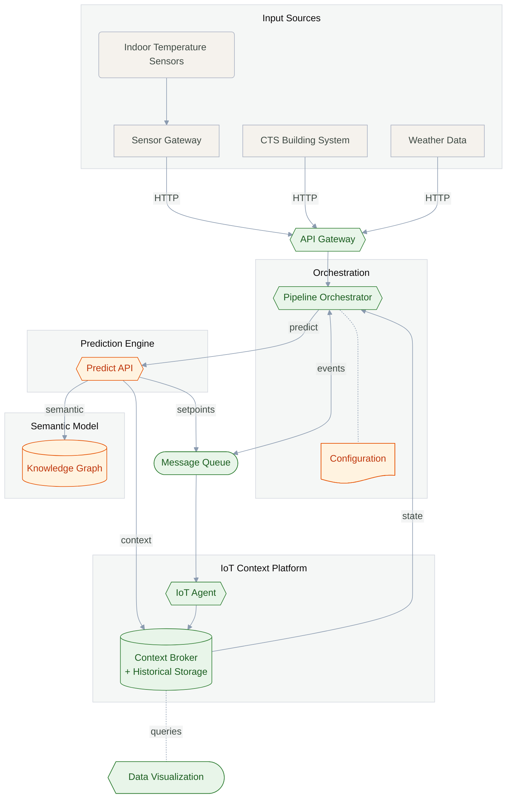

# Reference arkitektur
_Referencearkitekturen beskriver en open source-platform, der opfylder aiheatcontrols behov. Den er visualiseret som en [C4-model](https://c4model.com/) på to niveauer: **systemkontekst** (platformen set udefra) og **containere** (platformens interne komponenter)._


Dette referencearkitektur dokument henvender sig til tekniske beslutningstagere, arkitekter og leverandører.
Diagrammerne anvender engelske fagtermer, da det antages at disse er de genkendelige
standardbetegnelser på tværs af it-arkitekter og leverandører.


## System landskab
_Et samlet højniveau overblik over platformen, der illustrerer modtagelse af data fra indendørssensorer, CTS-anlæg og vejrdata — og hvordan platformen interagerer med anvendere, udviklere og driftsfolk. For en detaljeret opdeling af de interne komponenter, se **Container Diagram (Level 2)** nedenfor._

## Løsnings arkitektur {#container-diagram}



## Genbrug af komponenter
_I stedet for at investere i at bygge og vedligeholde sin egen integrationsplatform med databaser, enhedsstyring, API'er og brugergrænseflader – og dermed genopfinde funktionalitet, der allerede findes – er denne referencearkitektur løst koblet og baseret på genbrug af eksisterende Open Source løsninger._



[Envoy Proxy](https://www.envoyproxy.io/docs) - HTTP endpoints for alle datakilder



[WarpStream Bento](https://warpstreamlabs.github.io/bento/) – deklarative pipelines i et klart og menneskelæsbart format, der transformerer og videresender data



[NATS JetStream](https://docs.nats.io/nats-concepts/jetstream) – løskobling af datakilder og datamodtagere for at sikre pålidelige dataleverancer under høj belastning



[FIWARE IoT Agent](https://iotagent-node-lib.readthedocs.io/en/latest/) – bro mellem IoT-enheders protokoller og FIWARE Context Broker



[Grafana](https://www.grafana.com/docs/) - dashboards og visualisering af entiteter og tidsseriedata



[FIWARE Orion-LD](https://fiware-academy.readthedocs.io/en/latest/core/orion-ld.html) og [TimescaleDB](https://docs.timescale.com/) – underliggende, iot-datamodel, der samler realtidsdata og historik og kan kobles sammen med domænespecifikke bygnings-datamodeller.


