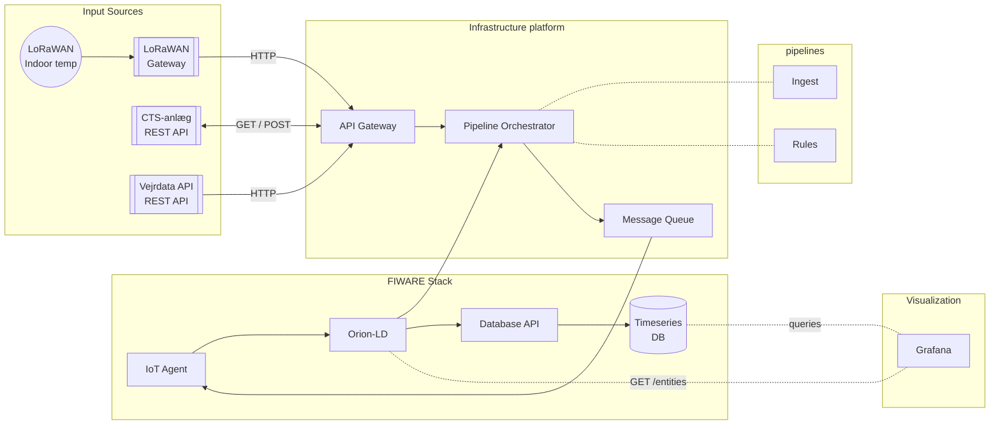

## Overblik

Dette dokument beskriver systemarkitekturen for OS2 AI Heat Control platformen. Systemet bruger en Pipeline Orchestrator til at koordinere dataflows fra forskellige inputkilder gennem deklarative pipelines, med FIWARE (Orion-LD, IoT Agent, Quantum Leap) som central datainfrastruktur.

### Dataflow



LoRaWAN sensorer (indoor temp), CTS-anlæg, Vejrdata API



Envoy Proxy - HTTP endpoints for alle datakilder



WarpStream Bento - deklarative pipelines der transformerer og router data



NATS JetStream - buffering og reliable delivery under høj belastning



FIWARE IoT Agent - device management og protokol konvertering



FIWARE Orion-LD - context broker med entitet historik



TimescaleDB - tidsserie-database via Quantum Leap API



## Architecture Diagram

## Hvorfor denne løsning?

Traditionelt skal man bygge sin egen integrationsplatform med databaser, device management, API'er og brugergrænseflader. Det tager tid og kræver vedligeholdelse.

**Her gør vi det anderledes:**

- **Ingen custom database** - alt lagres i FIWARE (Orion-LD + Quantum Leap/TimescaleDB)
- **Ingen brugergrænseflade** - alt er konfigurationsfiler
- **Pipeline Orchestrator** styrer dataflows automatisk
- **Deklarative YAML pipelines** - kun "hvad" der skal ske, ikke hvordan
- **NATS håndterer buffering og levering** - stabilitet under høj belastning

**Resultatet er simpelt:** Du skriver configs der fortæller "hvad" der skal ske - ikke hvordan. Og så virker det.

